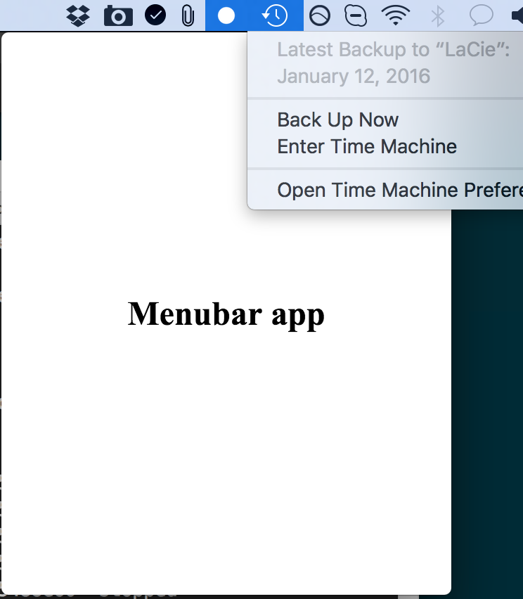

# NSEventMonitor
[](https://api.travis-ci.org/pronebird/NSEventMonitor)
[](https://david-dm.org/pronebird/NSEventMonitor)
[](https://david-dm.org/pronebird/NSEventMonitor?type=dev)

Currently when building menubar apps with Electron, `window.on('blur', ...)` does not fire if user clicks on other menubar items leaving displayed window on screen. 

Native macOS popovers usually hide if user clicks anywhere on screen. This extension attempts to fix that for Electron apps, so the following will never be the case anymore:



## Example

```js
import NSEventMonitor from 'nseventmonitor';

let macEventMonitor = new NSEventMonitor();

window.on('blur', () => {
  window.hide();
});

window.on('show', () => {
  tray.setHighlightMode('always');

  // start capturing global mouse events
  macEventMonitor.start(() => {
    window.hide();
  });
});

window.on('hide', () => {
  tray.setHighlightMode('never');

  // stop capturing global mouse events
  macEventMonitor.stop();
});
```

To run example app:

```
$ cd example
$ npm i
$ npm start
```

## Building

To compile the extension for the first time, run 

```
$ npm i
$ npm run configure
$ npm run build
```

All subsequent builds only need `npm run build`

You can confirm everything built correctly by [running the test suite](#to-run-tests).

### To run tests:

```
$ npm test
```
